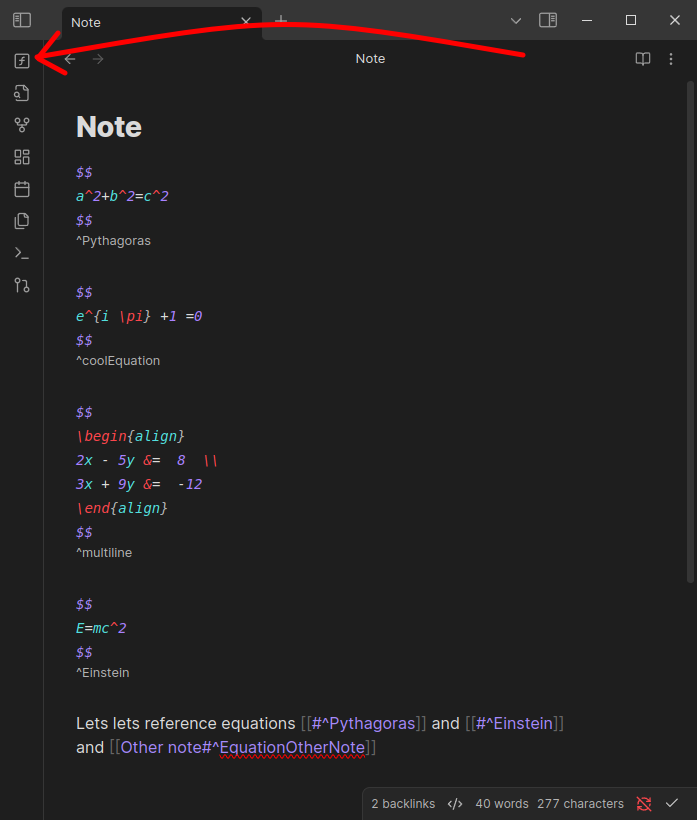
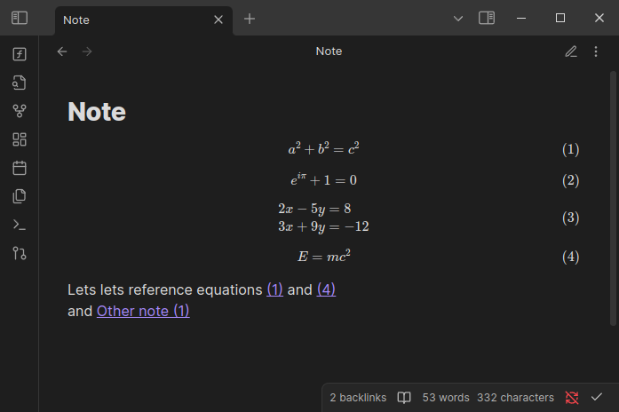

Equation Auto Numbering is a plugin for [Obsidian](https://obsidian.md/) that automates the numbering of equations and their references within your Markdown notes.

## Features

- **Equation Numbering**: Automatically assigns numbers to equations in the active note
- **Reference Updates**: Updates references to equations across all notes in your vault

## Installation

1. Download files `main.js` and `manifest.json` from the releases.
2. Go to your obsidian vaults plugin folder. Create a folder `equation-auto-numbering` and paste downloaded files there.
3. Enable the plugin in Obsidian by navigating to `Settings > Community Plugins > Installed Plugins`.
4. Activate "Equation Auto Numbering" plugin.

## How It Works

1. Create LaTeX equation blocks with or without references (`$$ ... $$ ^reference`).
2. Click the ribbon icon labeled "Update Equation Numbering" to run the plugin
3. It assigns a unique number to each equation and appends it as a reference tag (e.g. `(42)`).
4. References to equations are updated throughout your notes to match the assigned numbers.

## To change the plugin for your own needs

1. Edit file `src/main.ts`
2. Compile with `npx tsc`, that creates new `dist/main.js` file
3. Go ahead with Installation^^
